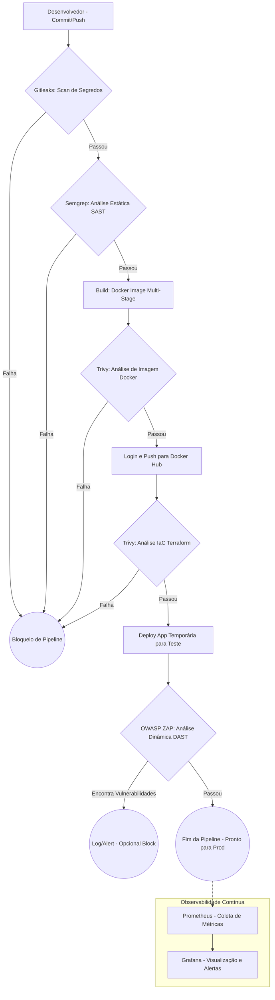

# Arquitetura e Diagrama de Fluxo - DevSecOps

## Diagrama de Fluxo (Pipeline CI/CD)

## Documento de Arquitetura

### Justificativas das Ferramentas Selecionadas

- **CI/CD (GitHub Actions)**: Escolhido por ser nativamente integrado ao repositório de código, facilitando a criação de pipelines descritivas (YAML) e possuindo vasto ecossistema de *actions* prontas para ferramentas de segurança.
- **Containerização (Docker)**: O projeto utiliza *multi-stage builds* no Dockerfile para garantir que apenas os artefatos compilados e de produção sejam enviados para a imagem final (`node:20-alpine`), reduzindo radicalmente a superfície de ataque e o tamanho da imagem hospedada no Docker Hub.
- **IaC (Terraform com LocalStack)**: Terraform provê infraestrutura imutável e declarativa. O uso em conjunto com o LocalStack permite simular toda a infraestrutura AWS (EC2 e Security Groups) de maneira local e sem custos, acelerando ciclos de teste.

### Implementação do Shift Left (Quality Gates)

A cultura DevSecOps foi implementada "movendo a segurança para a esquerda" (Shift Left), ou seja, validando cada etapa antes de avançar para a próxima. O bloqueio em caso de falha funciona da seguinte maneira:

1. **Pré-commit / Push Inicial (Gitleaks)**: Primeira barreira. Se alguma senha, chave de API ou token for detectado no código que sofreu push, o Gitleaks encerra a esteira com erro (exit-code 1).
2. **Integração / Build (Semgrep)**: Antes da criação da imagem, o código TypeScript/Node.js é escaneado em busca de vulnerabilidades de código (Injections, XSS). Falhas críticas interrompem a pipeline imediatamente.
3. **Pós-Build (Trivy)**: A imagem Docker gerada é analisada. O Trivy é configurado para retornar exit code `1` (bloqueando a pipeline) e não realizar o Push para o Docker Hub caso vulnerabilidades do tipo `CRITICAL` ou `HIGH` sejam encontradas nas bibliotecas ou no SO base. O Trivy também escaneia os arquivos da pasta `terraform/` procurando falhas de configuração (Security Groups muito abertos, por exemplo).
4. **Staging / DAST (OWASP ZAP)**: A aplicação é temporariamente "iniciada" no *runner* para que o ZAP execute um *baseline scan* simulando ataques reais. Por se tratar de um ambiente dinâmico, vulnerabilidades podem gerar bloqueio ou apenas *warnings* dependendo das políticas da equipe, mas o reporte fica atrelado ao Pull Request.
